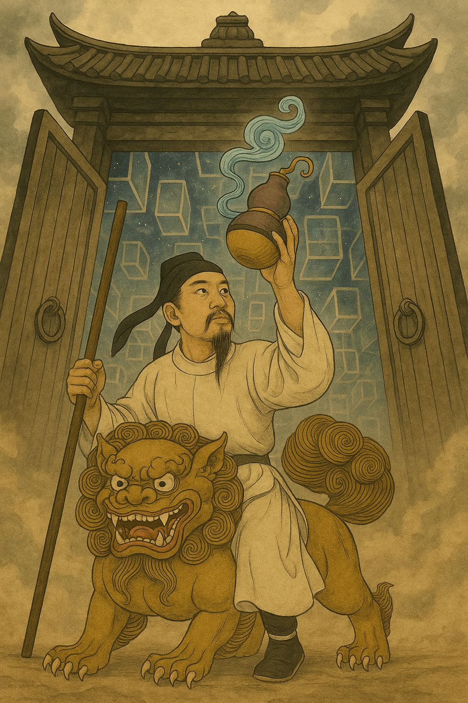

# MiSheng's Multirow Universe

- It is an tutorial game for the [MiSheng App](https://github.com/rr37/MiSheng-App). 
- This repository contains **image** and **CSV files** assets for the game **MiSheng's Multirow Universe**.    
- All content is created by me, and I hold the rights to license it.

  

## Example Google Sheet
Here is the example Google Sheet for **MiSheng's Multirow Universe**:  
[View the spreadsheet](https://docs.google.com/spreadsheets/d/1e6mD6Q_UKETNc7qrAeQA5M_Few-vwOhrBN-LFJIeohM/edit?usp=sharing)

## License
All files in this repository are licensed under **CC BY-NC 4.0**.  
See the full text in the [`LICENSE`](LICENSE) file.

### Usage
- You may copy, adapt, and share the content **for non-commercial purposes only**.
- You must give credit:  
  > © Dong, licensed under CC BY-NC 4.0. Source: GitHub repository "MiSheng's Multirow Universe"

### Sources
- Images: AI-generated by me and original designs by me
- CSV files: Created by me
